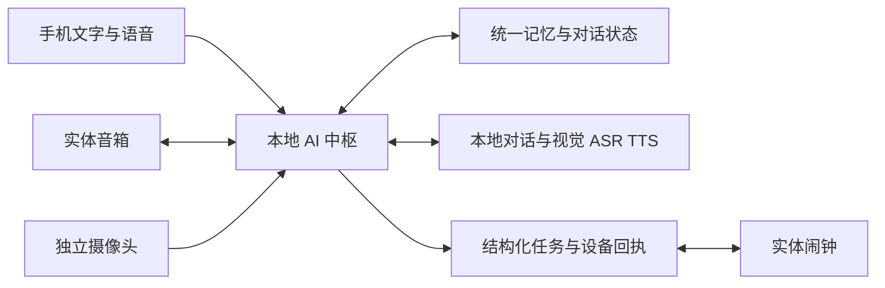

# AI万链

**有长期记忆的本地居家 AI 伙伴。**

让用户下班回家后，可以放松地交流，把生活安排交给熟悉自己的伙伴。AI万链以统一的 AI 中枢承载角色、记忆、对话和任务，通过手机、音箱、摄像头与家居设备融入日常生活。

**项目发起人：张万基（Star Zhang）｜AI 产品与智能交互｜计算机科学与技术硕士**

[产品设计与迭代](docs/product-case.md) · [系统架构](docs/architecture.md) · [实物验证与阶段成果](docs/validation.md) · [产品路线](docs/roadmap.md)

## 产品从什么问题出发

忙碌一天后，人们希望在家里获得轻松的交流和照应，也希望少花精力处理提醒、生活安排与次日准备。AI万链围绕这段居家时间设计连续体验：记住用户的偏好和计划，在不同终端延续交流，并把受托事项落实到真实设备。

产品面向愿意使用 AI 陪伴与居家助理的成年独居上班族。不同用户对主动交流的接受程度不同，因此交流风格、称呼和主动互动的尺度都属于产品设计的一部分。

公开角色为女性「小月」与男性「小星」；当前实物原型以小月开展体验验证。

## 已经可以体验什么

| 体验 | 当前实现 |
| --- | --- |
| 同一个伙伴，多个交流入口 | 手机文字／语音与实体音箱接入同一中枢，共用对话记录和记忆；手机支持历史查看与语音重听。 |
| 记得你的偏好与安排 | 保存、检索和更正重要记忆，支持配置称呼与交流风格。 |
| 叫名字开始交流 | 叫「小月」唤醒；音箱播完后开启约 15 秒的连续接话窗口。 |
| 自然的动态语音 | 根据新回复生成语音，以 24 kHz 音频增量播放；通过多轮对照试听优化音色、停顿与句尾。 |
| 看见眼前的物品 | 用户提问后从独立摄像头获取画面，在本地理解，再通过音箱回答。 |
| 把提醒落实到设备 | 自然语言设置实体闹钟，接收设备回执，到点响铃，按下表盘停止。 |
| 一台本地中枢组织设备 | 本地运行对话、识别与合成模块，提供一键启动及设备接入流程。 |

当前已接入 **手机、音箱、摄像头、实体闹钟 4 类终端**。具体实测场景见[验证记录](docs/validation.md)。

## 我的产品工作

我发起并主导 AI万链，从用户场景、需求优先级到交互设计、设备选型与实物验收，结合 AI 编程工具推进系统实现和原型集成。

- **定义体验：** 围绕回家、休息、交流、生活安排与睡前建立产品场景，将完整愿景拆成可体验、可验收的功能。
- **设计交互：** 推进叫名唤醒、连续接话、记忆更正、视觉问答与设备任务反馈，让交互符合用户的实际习惯。
- **推动迭代：** 把「机械感」「接不上话」「说设好了却没响」等反馈转化为具体问题、对照方案和验收条件。
- **衡量取舍：** 在单机本地运行、识别质量、语音自然度和响应时间之间进行方案比较，使用分段计时寻找瓶颈。

详见[三个产品迭代案例](docs/product-case.md)。

## 系统概览

**主要技术：** Python / FastAPI / SQLite / llama.cpp / Qwen 对话、视觉、ASR 与 TTS / ESP32-S3 设备接入。

中枢维护角色、记忆和任务，终端负责交流、感知与执行。关于调用流程和方案取舍，见[系统架构](docs/architecture.md)。

## Demo

实机演示视频正在准备，完成后将添加到本节。演示围绕连续语音交流、共享记忆、摄像头看物问答和实体闹钟执行展开。

## 产品下一步

围绕同一位居家伙伴，继续推进更低延迟的交互、适时主动关心、灯光等家居协同、会议资料整理与次日准备，以及外出时的手机联系；远期延伸到兼容机器人。分阶段目标见[产品路线](docs/roadmap.md)。

## 项目与交流

本仓库用于展示产品设计、系统架构和阶段成果。核心实现与专属语音资产保留私有；展示资料的使用范围见 [NOTICE](NOTICE.md)，上游技术见[技术致谢](ACKNOWLEDGEMENTS.md)。

欢迎通过 [GitHub 个人主页](https://github.com/Wanji02)交流 AI 产品、智能终端与居家交互方向。

更新于 2026 年 10 月 4 日。
