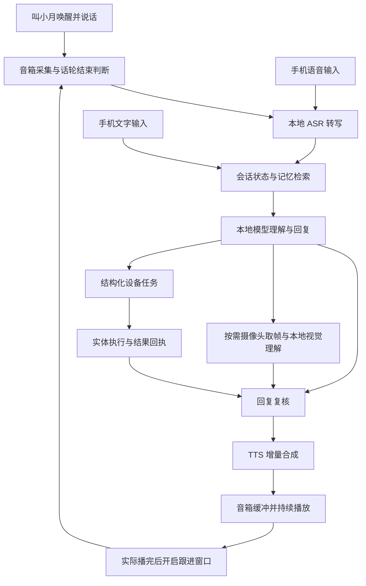

# AI万链系统架构

系统围绕一台本地 AI 中枢组织交互。角色、记忆、会话与任务由中枢统一维护，设备提供输入、表达与执行能力。

[返回项目首页](../README.md)

## 语音交互流程

当前语音合成和播放重叠执行；文字回复及复核完成后，再进入语音合成。更早输出首句的文字流水方案属于后续优化。

## 模块与选型

| 模块 | 当前技术 | 设计目的 |
| --- | --- | --- |
| 中枢服务 | Python、FastAPI、Uvicorn | 统一会话、任务、模型调用和设备接口 |
| 对话与视觉 | Qwen3.5-4B 量化模型、llama.cpp、本地视觉组件 | 在单机条件下处理交流和按需视觉问答 |
| 语音识别 | Qwen3-ASR-0.6B | 将语音转为文本，结合识别质量与等待时间迭代 |
| 语音合成 | Qwen3-TTS-12Hz-0.6B-Base、faster-qwen3-tts 路线 | 动态生成自然语音，支持增量播放 |
| 记忆与存储 | SQLite、记忆版本、中文字符二元组相关度检索 | 保存和更正重要信息，检索相关上下文 |
| 设备交互 | HTTP/HTTPS、设备任务与回执、音频传输 | 将中枢决策落实到输入输出和实体动作 |
| 状态管理 | 时间、在家状态、视觉观察与任务状态 | 为回答提供当前上下文与执行依据 |
| 运行管理 | 启动脚本、多模型资源调度、分段计时 | 便于单机启动、现场联调和性能分析 |

本仓库展示架构与选型；具体私有服务配置、角色策略和语音资产不随文档发布。

## 已接入的终端

- **手机浏览器：** 文字与语音输入、对话历史和语音重听。
- **ESP32-S3 音箱：** 唤醒、收音、回复播放和短时连续接话。
- **TP-LINK 独立摄像头：** 局域网取帧，为用户发起的视觉问题提供画面。
- **M5Dial 实体闹钟：** 接收提醒任务，到点响铃，表盘操作停止并回报。

## 本地化与扩展方式

当前对话、语音识别、语音合成与视觉理解采用本地推理路线，对话和记忆保存在中枢。外部设备接入与访问权限单独管理。

统一中枢使后续接入灯光、窗帘或兼容机器人时，可以沿用同一份会话与任务上下文。每类设备仍需要对应接口、权限与真实执行验证；扩展计划见[产品路线](roadmap.md)。
